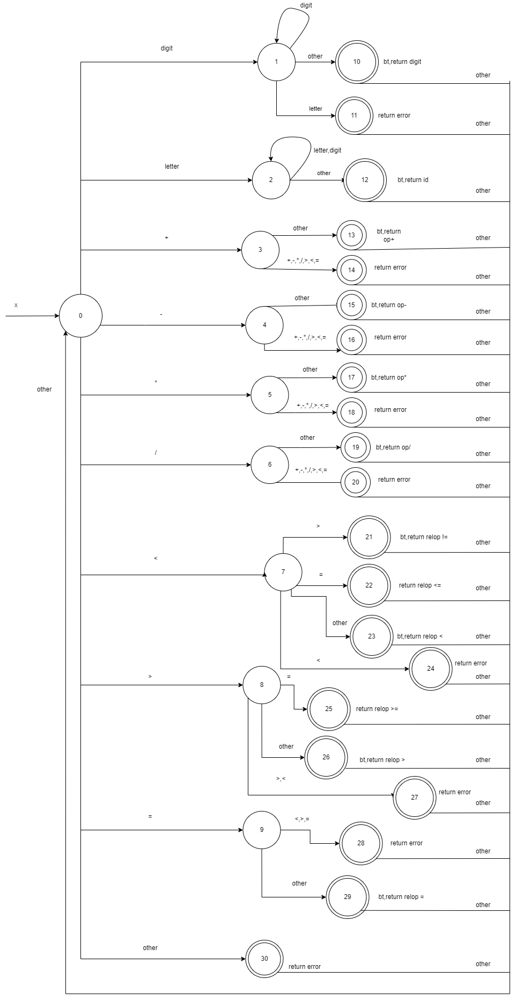

# simply_lexical_analysis
simply lexical analysis made with python
<h1>Ex:</h1>
"1+1=2"  is
['dig', '+', 'dig', '=', 'dig', '\n']
['1', '+', '1', '=', '2', '\n']
< digit,1 >
< op,+ >
< digit,1 >
< relop,= >
< digit,2 >
1w+w1=2 is
['dig', 'lett', '+', 'lett', 'dig', '=', 'dig', '\n']
['1', 'w', '+', 'w', '1', '=', '2', '\n']
< DigitERR,1w >
< op,+ >
< ID,w1 >
< relop,= >
< digit,2 >
<h1>DFA</h1>

